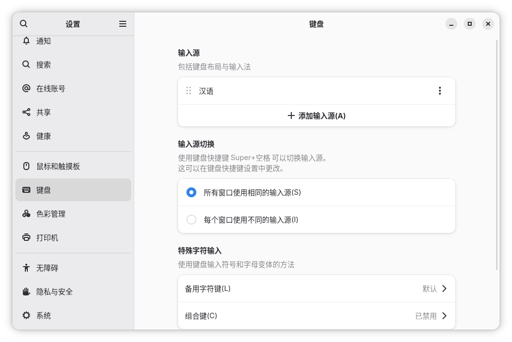
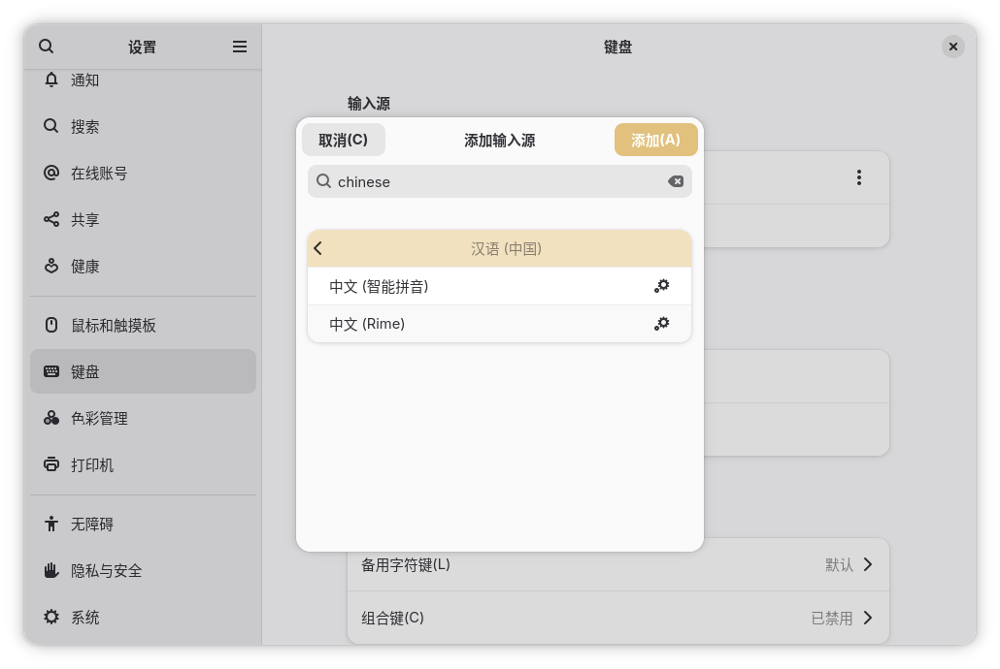

# Vanilla OS China Images

[中文](./README.md)

Containerfile for Vanilla OS China images.

The images are built in parallel based on the following images:

- [vanilla-os/gnome](https://github.com/Vanilla-OS/vso-image/pkgs/container/gnome) -> gnome-china
- [vanilla-os/gnome-nvidia](https://github.com/Vanilla-OS/vso-image/pkgs/container/gnome-nvidia) -> gnome-nvidia-china
- [vanilla-os/gnome-nvidia-modern](https://github.com/Vanilla-OS/vso-image/pkgs/container/gnome-nvidia-modern) -> gnome-nvidia-modern-china
- [vanilla-os/gnome-vm](https://github.com/Vanilla-OS/vso-image/pkgs/container/gnome-vm) -> gnome-vm-china

## Changes applied to images

- Pre-mirrored GHCR, Docker Hub & Flathub
- Pre-installed ibus-libpinyin & ibus-rime
- Use localized vso-china-image by default

## Installation

First, download the official ISO image from the [Vanilla OS website](https://vanillaos.org/) or the [TUNA mirror](https://mirrors.tuna.tsinghua.edu.cn/github-release/Vanilla-OS/live-iso). After downloading, use a USB writer tool to flash the ISO onto a USB drive. Then restart your computer, enter the BIOS/UEFI settings, and set the USB drive as the primary boot device.

To install a localized version, select the “Install Custom Image (Advanced)” option during system setup. Then, follow the instructions to configure your language and timezone. When the installer prompts you for the image name, enter one of the following (for example, use the NJU mirror; other mirrors are also available):

- ghcr.nju.edu.cn/vanilla-flavors/gnome-china:latest *(For most desktop users)*
- ghcr.nju.edu.cn/vanilla-flavors/gnome-nvidia-china:latest *(For older NVIDIA GPUs)*
- ghcr.nju.edu.cn/vanilla-flavors/gnome-nvidia-modern-china:latest *(For modern NVIDIA GPUs)*
- ghcr.nju.edu.cn/vanilla-flavors/gnome-vm-china:latest *(For virtual machines)*

If you have your Vanilla OS already installed, please use `abroot rebase <image>` to apply the localized image.

### Input Method

After installation and first boot, set up your user account, select the applications you need, and wait for the Vanilla OS First Setup to complete. Then, open GNOME Settings and navigate to Keyboard.

Click the plus sign (+) in the upper-right corner, search for "中文 (中国)", and select the desired input method.

This image comes with two input methods pre-installed:

- **Intelligent Pinyin (ibus-libpinyin)**: Works out of the box with no additional configuration required, but the candidate word mechanism may not be ideal.
- **Rime (ibus-rime)**: An intelligent input engine that allows you to freely install input schemas.

You can choose according to your own needs. If you choose Rime, you can press Ctrl+` or F4 in the input box to switch between input schemas, simplified/traditional Chinese, etc. The pre-installed Luna Pinyin schema is sufficient for most use cases, and you can also install other schemas such as Rime-Ice Pinyin.

DISCLAIMER: This image is NOT officially maintained by Vanilla OS.
